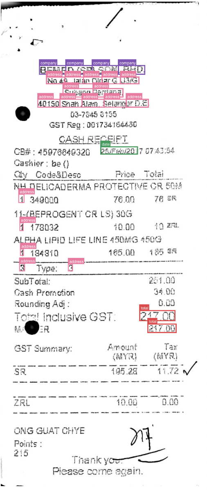
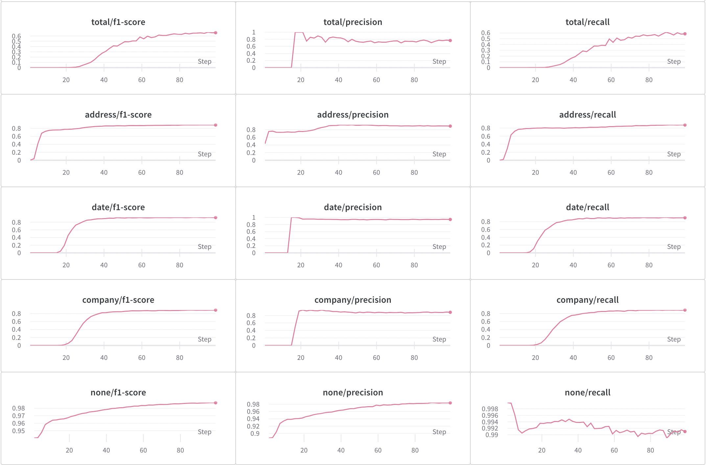

# LayoutLM on SROIE

This code fine-tunes [LayoutLM](https://github.com/microsoft/unilm/tree/master/layoutlm) on the [SROIE](https://rrc.cvc.uab.es/?ch=13) scanned receipts data, and uses [Weights & Biases](https://wandb.ai/site) to log losses and metrics during training, and annotated images with bounding box predictions. Here is the accompanying [Report](https://wandb.ai/wandb-data-science/layoutlm_sroie_demo/reports/Fine-tuning-LayoutLM-on-SROIE-Information-Extraction-from-Scanned-Receipts--VmlldzoxMjI5NzE2).

### **Example annotated receipt**
<center>
</img>
</center>


### **Plots of training metrics**
<center>
</img>
</center>

## Getting started

First, make sure to install the [pipenv](https://github.com/pypa/pipenv) environment, using `pipenv install`. This requires pipenv to have access to python 3.9. To install and manage different python versions, try out [pyenv](https://github.com/pyenv/pyenv).

### Preprocessing

The preprocessing for this slightly nonstandard, since the OCR and labels are given in a format that is not consistent with the per-token level classification setup that LayoutLM requires. More details given in this [section](https://wandb.ai/wandb-data-science/layoutlm_sroie_demo/reports/Fine-tuning-LayoutLM-on-SROIE-Information-Extraction-from-Scanned-Receipts--VmlldzoxMjI5NzE2#general-pipeline) of the report.

To run the preprocessing step, from the base directory, run

```python
python -m scripts.preprocess
```


Run from base directory (with pipenv environment activated) with

```python
python -m scripts.train
```
